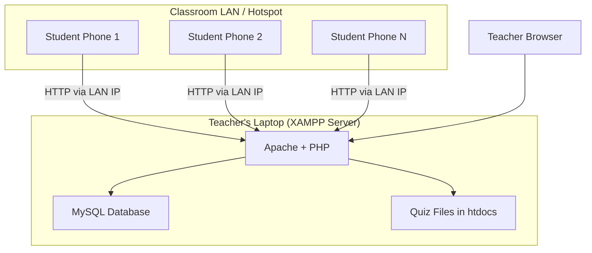
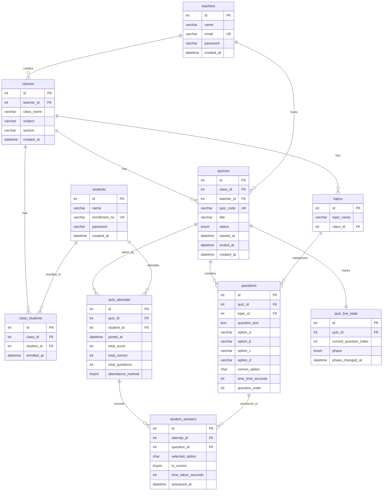
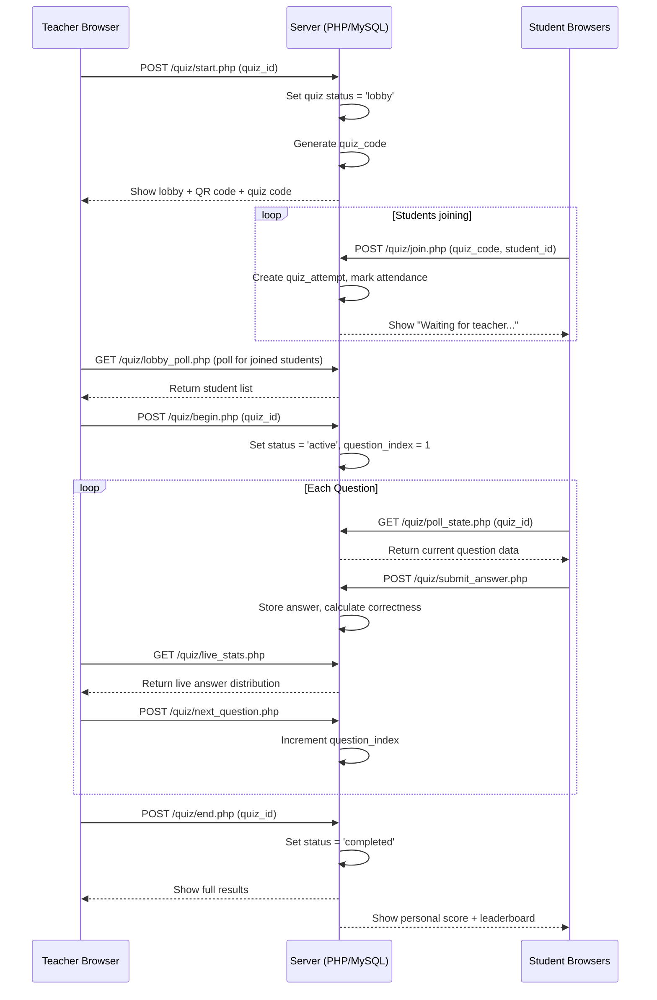

# QuizLAN — Offline-First College Quiz Platform

A PHP + MySQL quiz web app designed for colleges where **internet is unreliable**. Teachers host live quizzes after lectures, students join via QR/4-digit code, and both get detailed topic-wise performance analytics.

---

## Architecture Overview



### How It Works Without Internet

> [!IMPORTANT]
> The teacher's laptop runs **XAMPP** (Apache + MySQL). The teacher creates a **Wi-Fi hotspot** from their laptop (or uses a portable router). Students connect to this hotspot and access the quiz at `http://192.168.x.x/quizlan/`. **Zero internet required** — everything runs on the local network.

- The teacher's laptop acts as the **server** (XAMPP with Apache + MySQL)
- Teacher creates a **mobile hotspot** or uses a **portable Wi-Fi router** to form a LAN
- Students connect their phones/laptops to the same hotspot
- Students access the app via the teacher's **local IP address** (e.g., `http://192.168.137.1/quizlan/`)
- All data is stored locally in MySQL on the teacher's machine
- QR codes are generated **client-side** using a JS library (no internet needed)
- AJAX short-polling (every 2 seconds) is used for the live quiz experience — lightweight enough for LAN

---

## Tech Stack

| Layer | Technology |
|-------|-----------|
| Frontend | HTML5, CSS3, Vanilla JavaScript |
| Backend | PHP 8.x |
| Database | MySQL 8.x |
| Server | XAMPP (Apache) on teacher's laptop |
| Real-time | AJAX Short Polling (2s intervals) |
| QR Code | `qrcode.min.js` (bundled locally, no CDN) |
| Charts | `Chart.js` (bundled locally, no CDN) |
| Network | Wi-Fi Hotspot / Portable Router (LAN) |

> [!NOTE]
> All JS libraries (QR code generator, Chart.js) will be **bundled locally** in the project — no CDN links, no internet dependency.

---

## Database Schema (MySQL)



### Key Design Decisions

1. **`quiz_live_state` table** — Tracks which question is currently active and what phase (waiting/question/results). AJAX polling reads this table to sync all students.
2. **`topics` table** — Each question belongs to a topic, enabling topic-wise analytics.
3. **`quiz_attempts.attendance_marked`** — Auto-marks attendance when a student joins a quiz.
4. **`quiz_code`** — Random 4-digit alphanumeric code for easy joining.

---

## Resolved Design Decisions

| Decision | Choice |
|----------|--------|
| **Student Auth** | Enrollment number + password (teacher creates accounts, shares credentials) |
| **Teacher Auth** | Full registration with email + password |
| **Quiz Timer** | Per-question countdown (Kahoot style) |
| **Question Types** | MCQ only (4 options, 1 correct) |
| **Data Sync** | Each teacher laptop is independent — no cross-sync needed |

## User Roles & Access

| Feature | Teacher | Student |
|---------|---------|---------|
| Register / Login | ✅ (self-register) | ✅ (teacher creates, login with enrollment+password) |
| Create Class | ✅ | ❌ |
| Add/Remove Students | ✅ (creates student account with enrollment+password) | ❌ |
| Create & Host Quiz | ✅ | ❌ |
| Join Quiz (QR/Code) | ❌ | ✅ |
| Live Quiz Participation | Monitor | Answer |
| View Own Performance | ❌ | ✅ |
| View All Students' Performance | ✅ | ❌ |
| View Individual Student Detail | ✅ | ❌ |
| View Attendance Reports | ✅ | ✅ (own) |
| Topic-wise Analytics | ✅ (all students) | ✅ (own) |

---

## Project Parts (Implementation Order)

### Part 1 — Project Setup & Database
- Directory structure setup
- MySQL database creation script (`database.sql`)
- Database connection config (`config/db.php`)
- Base CSS design system (`assets/css/style.css`)
- Common header/footer includes
- Bundle local JS libraries (Chart.js, QR code)

### Part 2 — Authentication System
- Teacher registration & login (self-register with email + password)
- Student login only (enrollment number + password — account created by teacher)
- Session management
- Password hashing (bcrypt)
- Role-based redirects (teacher → dashboard, student → dashboard)
- Logout functionality

### Part 3 — Class Management (Teacher)
- Create class (name, subject, section)
- View all classes
- Edit/delete class
- Add students to class (enter name + enrollment number + password → creates student account & enrolls)
- Bulk import students via CSV (enrollment_no, name, password)
- Remove students from class
- View class roster

### Part 4 — Quiz Creation (Teacher)
- Create quiz for a class
- Add topics to quiz
- Add questions with 4 options, correct answer, topic tag, time limit
- Set question order
- Generate 4-digit quiz code
- Generate QR code (client-side JS)
- Preview quiz before hosting

### Part 5 — Live Quiz Engine
- **Teacher side**: Start quiz → controls question flow → shows live stats
- **Student side**: Join via code → lobby → answer questions → see immediate feedback
- **Flow**:
  1. Teacher clicks "Start Quiz" → status = `lobby`
  2. Students join using code → appear in lobby list
  3. Teacher clicks "Begin" → status = `active`, question 1 shown
  4. Students see question + countdown timer
  5. Students submit answer → stored in `student_answers`
  6. Timer expires → Teacher advances to next question
  7. After last question → status = `completed`
  8. Leaderboard shown
- **AJAX polling** (every 2s) keeps students in sync with `quiz_live_state`
- Attendance auto-marked on join

### Part 6 — Teacher Analytics Dashboard
- **Class Overview**: All classes with quiz count, student count
- **Quiz Report**: After each quiz — topic-wise breakdown
  - Bar chart: % correct per topic
  - List of weak topics (< 50% correct)
  - List of strong topics (> 80% correct)
- **Student List with Scores**: Ranked student performance per quiz
- **Individual Student Drill-down**: Click on a student to see:
  - All quizzes taken
  - Topic-wise performance across all quizzes
  - Trend over time (line chart)
  - Weak/strong topics
- **Attendance Report**: Per quiz and overall

### Part 7 — Student Performance Dashboard
- **My Classes**: List of enrolled classes
- **My Quizzes**: All quizzes taken with scores
- **Topic-wise Performance**: Radar/bar chart showing strength per topic
- **Per-Subject Breakdown**: Performance grouped by subject (class)
- **Quiz History**: Detailed view of each quiz attempt (question-by-question)
- **Attendance Record**: Personal attendance log

### Part 8 — Polish & LAN Setup Guide
- Responsive design for mobile (students will use phones)
- LAN setup instructions page (built into the app)
- IP address auto-detection (PHP `$_SERVER['SERVER_ADDR']`)
- QR code shows LAN URL automatically
- Final testing and bug fixes
- README with setup instructions

---

## Live Quiz Flow (Detailed)



---

## Directory Structure

```
quizlan/
├── assets/
│   ├── css/
│   │   └── style.css              # Global design system
│   ├── js/
│   │   ├── chart.min.js           # Chart.js (bundled locally)
│   │   ├── qrcode.min.js          # QR code generator (bundled locally)
│   │   └── app.js                 # Common JS utilities
│   └── images/
│       └── logo.png
├── config/
│   ├── db.php                     # MySQL connection
│   └── session.php                # Session management
├── includes/
│   ├── header.php                 # Common header
│   ├── footer.php                 # Common footer
│   ├── functions.php              # Helper functions
│   └── auth_check.php             # Auth middleware
├── auth/
│   ├── login.php                  # Login page (both roles)
│   ├── register.php               # Register page (both roles)
│   ├── logout.php                 # Logout
│   └── process_auth.php           # Auth processing
├── teacher/
│   ├── dashboard.php              # Teacher home
│   ├── classes.php                # Manage classes
│   ├── class_detail.php           # Single class view
│   ├── create_quiz.php            # Quiz creation form
│   ├── host_quiz.php              # Live quiz hosting (lobby + control)
│   ├── quiz_report.php            # Post-quiz analytics
│   ├── student_detail.php         # Individual student analytics
│   ├── attendance.php             # Attendance reports
│   └── ajax/                      # Teacher AJAX endpoints
│       ├── add_student.php
│       ├── remove_student.php
│       ├── start_quiz.php
│       ├── next_question.php
│       ├── end_quiz.php
│       ├── lobby_poll.php
│       └── live_stats.php
├── student/
│   ├── dashboard.php              # Student home
│   ├── join_quiz.php              # Join via code
│   ├── quiz_play.php              # Live quiz answering
│   ├── performance.php            # Performance dashboard
│   ├── quiz_history.php           # Past quiz details
│   └── ajax/
│       ├── poll_state.php
│       ├── submit_answer.php
│       └── check_results.php
├── database.sql                   # Full DB schema
├── index.php                      # Landing page
├── setup.php                      # LAN setup helper
└── README.md                      # Installation guide
```

---

## UI Design Direction

- **Color Palette**: Dark mode primary with electric blue (#4F8EF7) and emerald green (#10B981) accents
- **Typography**: System fonts (no Google Fonts — works offline): `-apple-system, BlinkMacSystemFont, 'Segoe UI', Roboto, sans-serif`
- **Cards**: Glassmorphism effect with subtle backdrop blur
- **Animations**: CSS transitions on hover, smooth page transitions
- **Mobile-First**: Students will primarily use phones, so mobile responsiveness is critical
- **Dashboard Charts**: Chart.js for bar, radar, line, and doughnut charts

---

## All Questions Resolved ✅

All design decisions have been finalized. Ready to implement.

---

## Verification Plan

### Automated Testing
- Run the SQL schema to verify no syntax errors
- Test each PHP endpoint manually via browser
- Test AJAX polling with multiple browser tabs simulating students

### Manual Verification
- Full flow test: Teacher creates class → adds students → creates quiz → hosts live → students join → answer → view results
- Mobile responsiveness check on phone browser
- LAN test: Run XAMPP, create hotspot, access from another device
- Performance test: Simulate 30+ students polling simultaneously

---

## Implementation Timeline

| Part | Description | Estimated Files |
|------|-------------|----------------|
| **Part 1** | Setup, DB, Config, CSS | ~8 files |
| **Part 2** | Auth System | ~6 files |
| **Part 3** | Class Management | ~5 files |
| **Part 4** | Quiz Creation | ~4 files |
| **Part 5** | Live Quiz Engine | ~12 files |
| **Part 6** | Teacher Analytics | ~5 files |
| **Part 7** | Student Dashboard | ~5 files |
| **Part 8** | Polish & LAN Guide | ~3 files |

> [!TIP]
> I recommend we build **Part 1 + Part 2 + Part 3** first, then **Part 4 + Part 5** (the core quiz engine), and finally **Part 6 + Part 7 + Part 8** (analytics and polish). This way you can start testing the quiz flow early.
